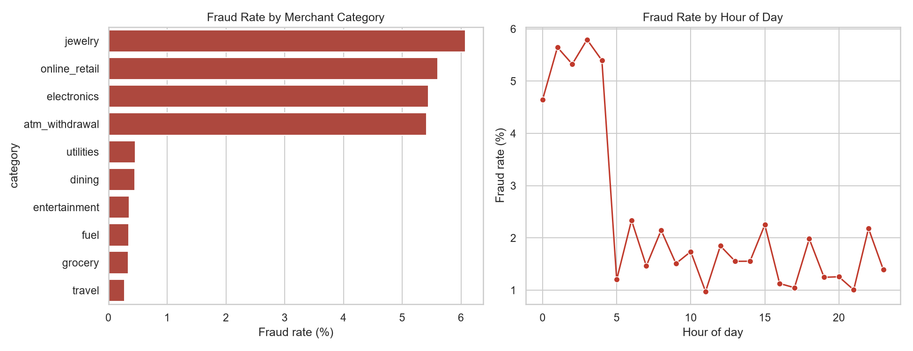
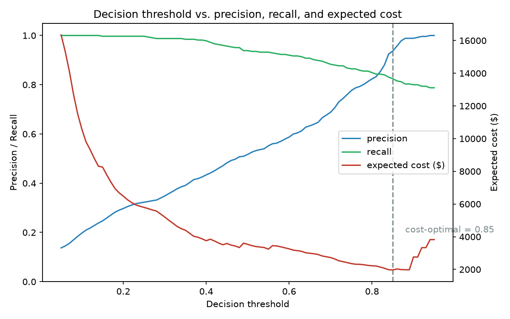
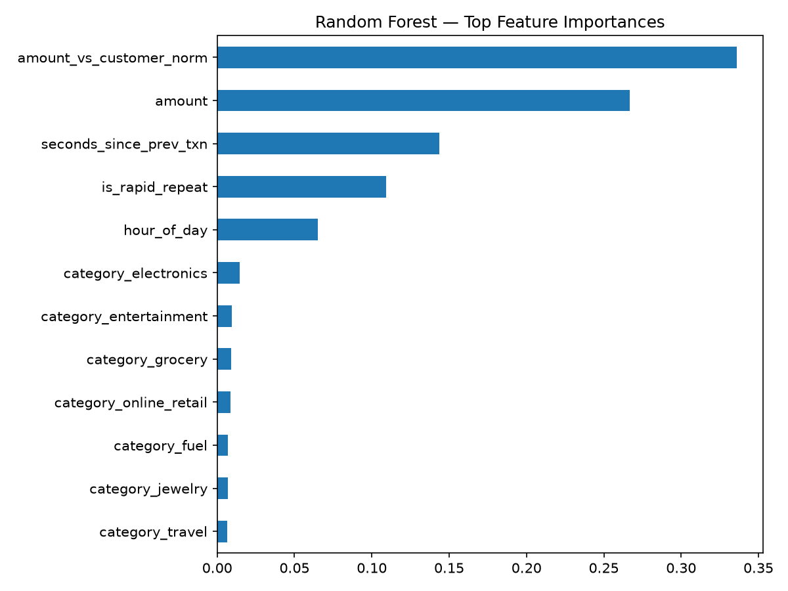

# Fraud Detection Engine

[](https://github.com/dhandashreya/fraud-detection-engine/actions/workflows/ci.yml)


An end-to-end fraud-detection pipeline: synthetic transaction data → SQL analysis →
a classification model evaluated the way fraud actually has to be evaluated — on
precision/recall and **dollar cost**, not accuracy — then turned into a runnable
scorer that flags transactions for review.

## Results at a glance

The same modelling pipeline — temporal split, balanced Random Forest, evaluated on
precision/recall/PR-AUC — run on both a synthetic dataset (built here, for the SQL
and EDA story) and the real ULB credit-card-fraud dataset (PCA features, no
business meaning). Random Forest, temporal split, decision threshold 0.5:

| Dataset | Transactions | Fraud rate | Precision | Recall | F1 | PR-AUC | Cost-optimal threshold saves |
|---|--:|--:|--:|--:|--:|--:|--:|
| **Synthetic** (`train_model.py`) | 59,373 | 2.39% | 0.52 | 0.94 | 0.67 | **0.93** | 44% |
| **Real — ULB** (`real_data_benchmark.py`) | 284,807 | 0.17% | 0.86 | 0.77 | 0.81 | **0.81** | 5% |

Baseline Logistic Regression is beaten on both (PR-AUC 0.82 synthetic / 0.75 real,
and on the real data its precision collapses to 4%). Details:
[synthetic](#model-results) · [real](#real-data-benchmark).

## Why synthetic data

Public fraud datasets (e.g. Kaggle's credit-card-fraud set) are PCA-anonymized —
the columns are literally named `V1`...`V28` with no real meaning, which makes for
a weak SQL/EDA story. This project generates its own transaction stream instead,
with interpretable fields and deliberately injected fraud patterns — then
[benchmarks the model on the real ULB dataset](#real-data-benchmark) to show the
approach still holds up:

- **Odd-hour transactions** (midnight–4am)
- **Amount spikes** relative to a customer's own spending history
- **High-risk categories** (electronics, jewelry, online retail, ATM withdrawals)
- **Card-testing bursts** — several small rapid-fire charges from the same
  customer within seconds of each other, a real-world fraud pattern

`seconds_since_prev_txn` is not a fabricated label — it's computed per customer
from the actual transaction timestamps (`groupby("customer_id")["timestamp"].diff()`),
so both the SQL queries and the model are working off a genuine feature. The
generator is fully seeded, so `python src/generate_data.py` reproduces the exact
dataset every run.

## Pipeline

```bash
pip install -r requirements.txt
python src/generate_data.py      # generates data/{customers,merchants,transactions}.csv
python src/load_to_sqlite.py     # loads CSVs into data/fraud.db
python src/run_sql_report.py     # runs sql/analysis_queries.sql -> reports/sql_findings.md
python src/eda.py                # -> reports/eda_*.png
python src/train_model.py        # trains + evaluates, picks a threshold -> reports/*, models/fraud_model.joblib
python src/score.py              # flags transactions -> reports/flagged_transactions.csv
```

`src/features.py` holds the feature engineering shared by training and scoring, so
the two paths can't drift apart (the classic train/serve skew bug).

## Tests

`tests/test_pipeline.py` runs the actual pipeline scripts end to end (not a
reimplementation) and asserts on the real output: dataset scale and
reproducibility, card-testing burst detection, the SQL report's contents, a
minimum performance bar on the trained model (recall > 0.85, PR-AUC > 0.85), that
the cost-optimal threshold never loses to the default 0.5, and that the persisted
model loads and scores. A future change that silently degrades any of these fails
CI instead of shipping quietly.

```bash
pip install -r requirements.txt pytest
pytest tests/ -v
```

Runs automatically on every push via [GitHub Actions](.github/workflows/ci.yml).

## Dataset

59,373 transactions · 2,000 customers · 300 merchants · **2.39% fraud rate**
(realistic for card fraud — this is why accuracy is the wrong metric below)

## SQL analysis

Full runnable query set: [`sql/analysis_queries.sql`](sql/analysis_queries.sql) · results: [`reports/sql_findings.md`](reports/sql_findings.md)

Highlights:
- **Category risk is concentrated**: jewelry, online retail, electronics, and ATM
  withdrawals each run a 5–6% fraud rate — ~16x higher than grocery/fuel/travel
  (~0.3%) — and **90% of all fraud** falls in those four categories
- **Roughly half of all fraud happens between midnight and 5am** (a 5-hour window
  that's 21% of the day), where the fraud rate is 4.6–5.8% vs. ~1–2% the rest of
  the day
- A window-function query (`LAG() OVER (PARTITION BY customer_id ORDER BY timestamp)`)
  isolates card-testing bursts: customers with ≥2 transactions under 120 seconds
  apart are fraud in nearly every case
- A risk-bucket validation query shows the merchant `merchant_risk_score` field
  (assigned independently of the fraud labels) does **not** actually correlate with
  real fraud rate — it sits at ~2.0–2.6% across every bucket — a useful negative
  result showing category and behavior matter more than a merchant's static score



## Model results

The data is split **temporally** — train on the earlier transactions, test on the
later ones — because a random split lets the model peek at the future and flatters
the numbers.

Class imbalance (2.2% positive in the test window) makes accuracy meaningless — a
model that predicts "not fraud" for every transaction scores ~97.8% accuracy while
catching zero fraud. Evaluated on **precision, recall, F1, and PR-AUC** instead.

| Model | Precision | Recall | F1 | PR-AUC |
|---|---|---|---|---|
| Logistic Regression (balanced) | 0.324 | 0.815 | 0.464 | 0.822 |
| **Random Forest (balanced)** | **0.517** | **0.938** | **0.667** | **0.932** |

At the default 0.5 cutoff the Random Forest catches **94% of fraud** — but at the
cost of 285 false positives in the test window. That's the real question a fraud
team faces, so the model doesn't stop at 0.5:

### Picking the decision threshold by dollar cost

`train_model.py` sweeps every threshold and scores each one against an explicit
cost model — **$8 per false positive** (an analyst manually reviews a flagged
legit charge) vs. **the full transaction amount per missed fraud** (the money is
gone):

| Threshold | Precision | Recall | False positives | Missed fraud $ | Expected cost |
|---|---|---|---|---|---|
| 0.50 (default) | 0.52 | 0.94 | 285 | \$1,256 | \$3,536 |
| **0.85 (cost-optimal)** | **0.94** | **0.82** | **18** | \$1,826 | **\$1,970** |

Moving to the cost-optimal threshold **cuts expected cost 44%**: you let through a
bit more low-value fraud but stop drowning analysts in false alarms. The chosen
threshold is saved with the model and used by `src/score.py`.



**Top predictive features**: transaction amount relative to the customer's own
spending norm, raw amount, seconds since the customer's previous transaction, and
the rapid-repeat flag — confirming the model is actually learning the behavioral
fraud signals rather than shortcutting on merchant category.



## Scoring new transactions

`src/score.py` loads `models/fraud_model.joblib` (the fitted Random Forest + the
cost-optimal threshold), rebuilds the same features, and writes the flagged
transactions to `reports/flagged_transactions.csv`, highest fraud score first:

```bash
python src/score.py                     # scores data/transactions.csv
python src/score.py path/to/other.csv   # any CSV with the same columns
```

On the full dataset it flags ~2.2% of transactions for review and, checked
against the known labels, catches 88% of fraud at 96% precision.

## Real-data benchmark

`src/real_data_benchmark.py` runs the *same* discipline — temporal split, the
same two models, imbalanced metrics, the same dollar-cost threshold sweep — on
the canonical real-world dataset: the [ULB credit-card-fraud set](https://www.openml.org/d/1597)
(284,807 real transactions from September 2013, 0.17% fraud). It's a check that
the approach isn't just memorising patterns this repo injected.

```bash
python src/real_data_benchmark.py   # fetches the ~150 MB dataset from OpenML (cached)
```

Results ([`reports/real_data_benchmark.md`](reports/real_data_benchmark.md), temporal split, threshold 0.5):

| Model | Precision | Recall | F1 | PR-AUC |
|---|---|---|---|---|
| Logistic Regression (balanced) | 0.04 | 0.89 | 0.08 | 0.75 |
| **Random Forest (balanced)** | **0.86** | **0.77** | **0.81** | **0.81** |

The Random Forest transfers: **PR-AUC 0.81** on genuinely unseen fraud, ~0.86
precision at ~0.77 recall. Logistic Regression's recall looks fine but its
precision collapses to 4% (1,800 false alarms) — the same model-choice lesson as
on the synthetic data, sharper. The cost-optimal threshold only saves ~5% here
because the Random Forest already fires so few false positives.

The features are PCA components (`V1`…`V28`) with no business meaning, so there's
no SQL/EDA layer for this dataset — that's exactly the trade-off the synthetic
data was chosen to avoid. This is kept out of the main CI job (heavy download)
and runs on its own [monthly workflow](.github/workflows/real-data-benchmark.yml).

## Limitations

- **Synthetic data.** The fraud patterns are injected by `generate_data.py`, so
  the model is partly learning rules this project wrote. The value here is the
  end-to-end method (SQL → cost-aware modeling → scoring), not the accuracy number.
- **`seconds_since_prev_txn` is computed over each customer's full history**, so a
  transaction near the temporal split "knows" about neighbours on the other side.
  The leakage is small (it only depends on that one customer's timeline) but real.
- **No concept drift handling or online retraining** — the model is fit once on a
  fixed window.
- Merchant/customer identifiers are treated as non-predictive; a production system
  would add entity-level history and velocity features.

## Project structure

```
data/        generated CSVs + SQLite database (db file gitignored, regenerate via scripts)
sql/         schema + analyst queries
src/         pipeline scripts (data gen, shared features, load, SQL report, EDA, train, score) + real_data_benchmark
models/      persisted model artifact (gitignored, regenerate via train_model.py)
real_data/   downloaded ULB dataset cache (gitignored)
reports/     generated charts, SQL findings, model metrics, flagged transactions, real-data benchmark
```

## Stack

Python · pandas · SQLite · scikit-learn (Logistic Regression, Random Forest) ·
matplotlib/seaborn · joblib

## License

MIT — see [LICENSE](LICENSE).
