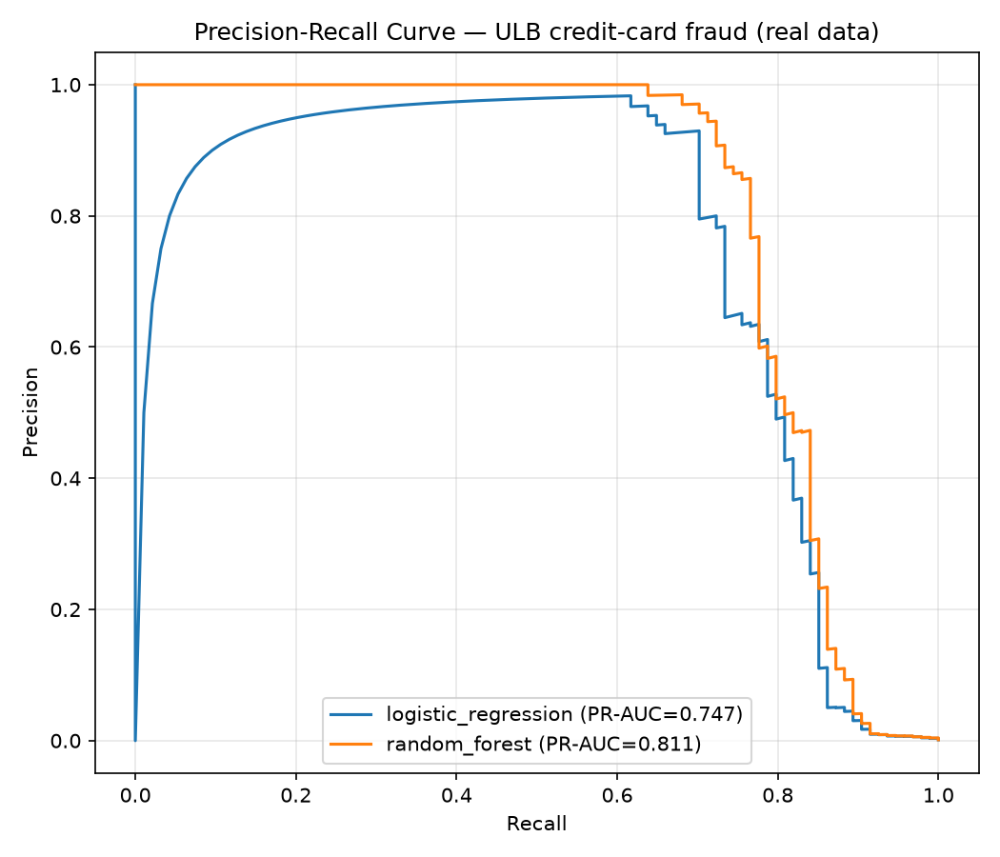

# Real-data benchmark — ULB credit-card fraud

The same pipeline discipline as the synthetic project, applied to a real dataset
to check the approach isn't just memorising rules this repo wrote.

- **Dataset**: ULB credit-card fraud (284,807 transactions, Sep 2013) — fraud rate 0.173%
- **Source**: OpenML 1597 (Time dropped as a row id; split by chronological row order)
- **Split**: temporal — earlier 213,605 train / later 71,202 test (fraud rate in the test window: 0.132%)

## Model results (temporal split, threshold 0.5)

| Model | Precision | Recall | F1 | PR-AUC |
|---|---|---|---|---|
| Logistic Regression (balanced) | 0.0444 | 0.8936 | 0.0845 | 0.7466 |
| **Random Forest (balanced)** | **0.8571** | **0.766** | **0.809** | **0.8109** |

## Cost-based threshold (Random Forest)

Cost model: $8 per false positive vs. the transaction amount per missed fraud.

| Threshold | Precision | Recall | False positives | Missed fraud $ | Expected cost |
|---|---|---|---|---|---|
| 0.50 (default) | 0.8571 | 0.766 | 12 | $2,643 | $2,739 |
| 0.43 (cost-optimal) | 0.7604 | 0.7766 | 23 | $2,406 | $2,590 |

Cost reduction vs. the default 0.5 cutoff: **5.4%**.

_Generated by `src/real_data_benchmark.py`._
