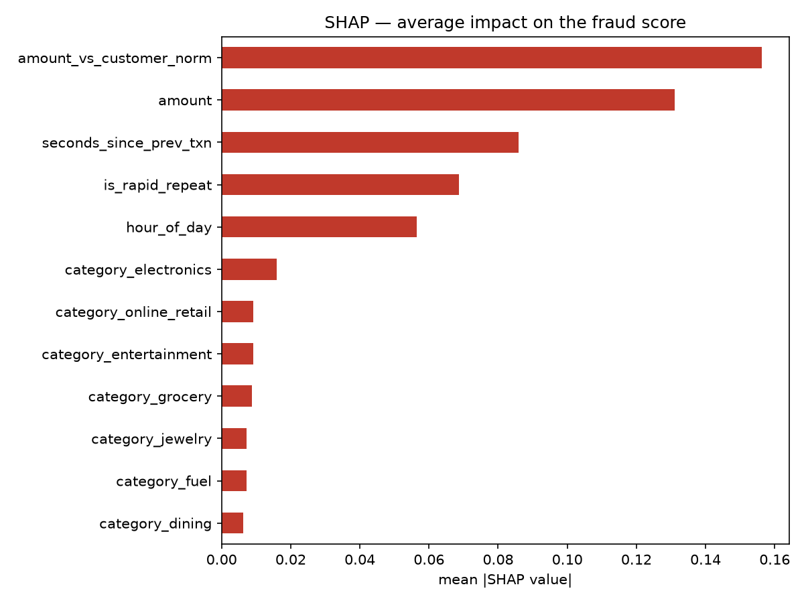
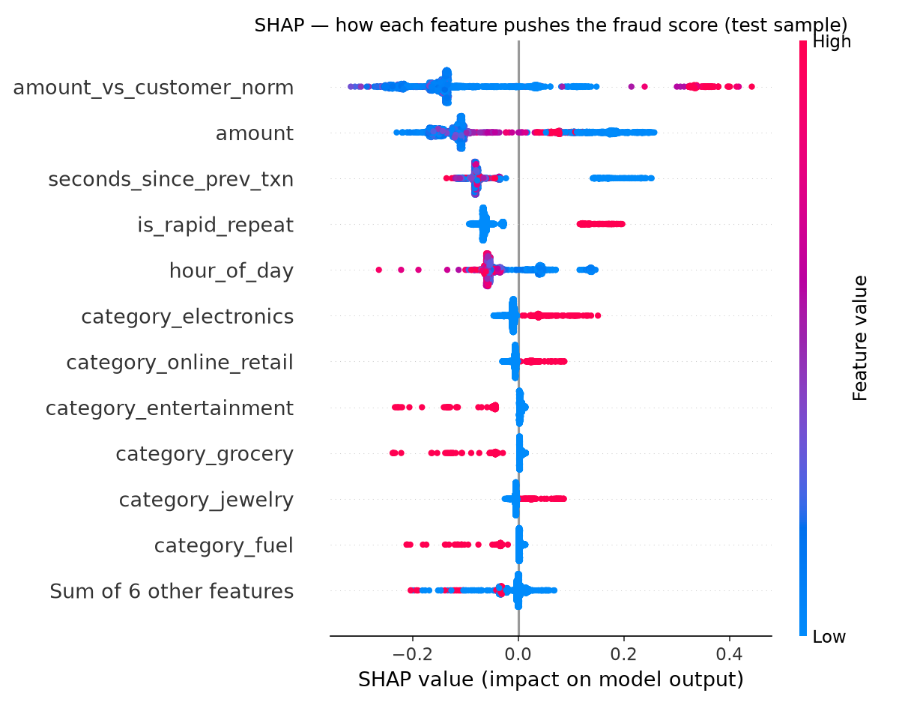

# SHAP findings — Random Forest

Computed by `src/explain_model.py` on a 2,000-row sample of the
held-out temporal test set (all 325 frauds + 1,675 legit).

## Average impact on the fraud score (mean |SHAP|)

| Feature | mean \|SHAP\| |
|---|--:|
| `amount_vs_customer_norm` | 0.1563 |
| `amount` | 0.1310 |
| `seconds_since_prev_txn` | 0.0859 |
| `is_rapid_repeat` | 0.0687 |
| `hour_of_day` | 0.0564 |
| `category_electronics` | 0.0160 |
| `category_online_retail` | 0.0091 |
| `category_entertainment` | 0.0091 |

## Direction

The beeswarm below shows *which way* each feature pushes the score. The dominant
signals are behavioural, not categorical:

- **`amount_vs_customer_norm`** and **`amount`** — large charges relative to the
  customer's own norm push strongly toward fraud (high feature value = high SHAP).
- **`seconds_since_prev_txn`** — small gaps push toward fraud; **`is_rapid_repeat`**
  fires on the card-testing bursts.
- **`hour_of_day`** — the midnight–4am band pushes up; merchant category barely
  moves the score once behaviour is accounted for.

## Single-decision explanation

`reports/shap_waterfall_fraud.png` breaks down the highest-scored fraud in the
test set (score 1.00) — the exact contribution of each
feature to that one prediction, which is what an analyst reviewing a flagged
transaction would want to see. Top drivers here: `seconds_since_prev_txn` (+0.22), `amount` (+0.17), `is_rapid_repeat` (+0.17).

## Consistency with gini importance

SHAP's top 5 and the Random Forest's gini top 5 share **5/5** features
(SHAP: ['amount_vs_customer_norm', 'amount', 'seconds_since_prev_txn', 'is_rapid_repeat', 'hour_of_day']). Agreement is expected — it's a sanity check that the
explanation reflects the model, not an artefact of the method.

_Generated by `src/explain_model.py`._
